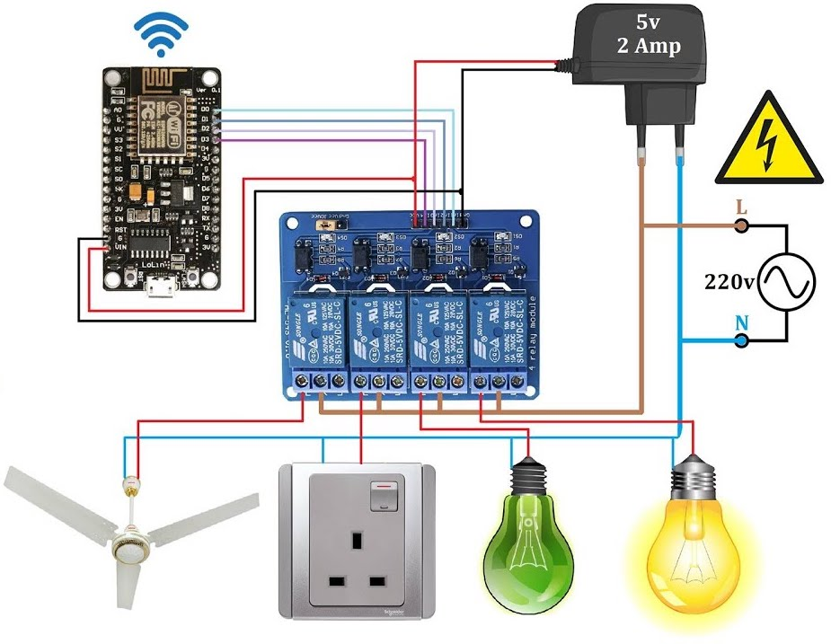

# Building an MQTT Application to Control 4 AC Bulbs using MIT App Inventor with NodeMCU

This project demonstrates how to use MQTT to control 4 AC bulbs using the MIT App Inventor platform and NodeMCU. MQTT is a lightweight messaging protocol that is ideal for IoT applications, and NodeMCU is an open-source firmware that allows you to program the ESP8266 Wi-Fi module.

## Requirements

- 4 AC bulbs
- NodeMCU
- MIT App Inventor account
- MQTT broker (e.g. Mosquitto)

## Setup

1. Install the latest version of the Arduino IDE on your computer.

2. Install the MQTT library in Arduino IDE by navigating to `Sketch > Include Library > Manage Libraries`. Search for "PubSubClient" and install the library.

3. Connect the NodeMCU to your computer via USB.

4. Open Arduino IDE and navigate to `File > Preferences`. In the "Additional Boards Manager URLs" field, add the following link:
   ```
   http://arduino.esp8266.com/stable/package_esp8266com_index.json
   ```
   Click "OK" to save the changes.

5. Navigate to `Tools > Board > Boards Manager`. Search for "ESP8266" and install the package.

6. Select the NodeMCU board from `Tools > Board > NodeMCU 1.0 (ESP-12E Module)`.

7. Set the upload speed to `115200` from `Tools > Upload Speed`.

8. Enter the SSID and password for your Wi-Fi network from `Tools > Port > /dev/cu.SLAB_USBtoUART`.

9. Download the sample code for the NodeMCU from this repository and open the `.ino` file in Arduino IDE.

10. Replace the MQTT broker details with your own broker details, including the broker IP address and port number.

11. Connect the AC bulbs to the NodeMCU by following the circuit diagram provided in this repository.

12. Upload the code to the NodeMCU by clicking the "Upload" button in the Arduino IDE.

13. Once the code is uploaded, open the Serial Monitor from `Tools > Serial Monitor`.

14. Verify that the NodeMCU has connected to the Wi-Fi network and MQTT broker by checking the Serial Monitor output.

15. Create a new project on MIT App Inventor and import the `.aia` file provided in this repository.

16. Modify the MQTT broker details in the MIT App Inventor project to match your own broker details.

17. Build the app by clicking the "Build" button in MIT App Inventor.

18. Install the app on your mobile device.

19. Open the app and verify that you can control the AC bulbs by tapping the on/off buttons.

## Circuit Diagram



## MQTT Application


## Notes

- Make sure to use caution when working with electricity.
- Always unplug the NodeMCU before making any modifications to the circuit.
- If you're having trouble connecting to the MQTT broker, make sure that your broker is configured to allow external connections.
- If you're having trouble uploading the code to the NodeMCU, try pressing and holding the "FLASH" button on the NodeMCU while uploading the code.
